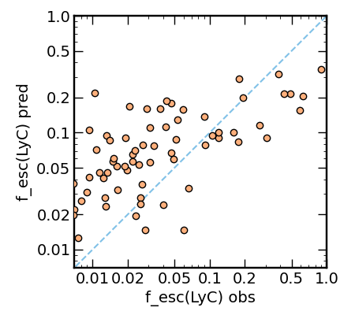

# LyCsurv

Based on Jaskot et al. (2024a,b), the `LyCsurv` code predicts Lyman continuum (LyC) escape fractions (fesc) from given input variables using the Low-redshift Lyman Continuum Survey (LzLCS, Flury et al 2022a) combined with results from the literature. The authors request that any use of this code cite Jaskot et al. (2024a). A BibTeX reference is provided at the end of this document.

## Practical Details

The `LyCsurv` scripts depend on several software packages which are readily installed using `pip` from the command line. These packages include `numpy`, `matplotlib`, `lifelines`, and `scikit-survival`. For example
```
$ pip install lifelines
```

Calling the `LyCsurv.CoxPH` or `LyCsurv.AFT` functions will return an Nx3 array of the predicted fesc and its lower and upper uncertainties in the first, zeroth, and second rows, respectively, for each of N galaxies. In the worked examples below, N=1.

All files and scripts necessary to run `LyCsurv` are contained in this repository, including combined LzLCS+archival data (`./tab/lzlcs.csv`), a file to control input parameters (`./tab/params.lis`), and the source code (`LyCsurv.py`). To run `LyCsurv`, simply download the zipped directory or clone the directory using `git`. To run locally, navigate into the `LyCsurv` (or `LyCsurv-main`) directory and simply use an `ipython` terminal or write a new script based on the examples below.

Variables for input are controlled via a table `./tab/params.lis`. To exclude a variable from the fitting routine, simply include a \# at the start of the line just as in python comments. To include a variable, simply delete the \#. In the examples below, only the `O32` and `beta1550` variables are included. The params file is the only file the user should alter in any way.

Input data should come in the form of a dictionary or `pandas` dataframe (the latter is recommended). All columns to be used with `LyCsurv` must be named such that they match the names in the `params.lis` table.

For details, API documentation for `LyCsurv` is available [here](https://github.com/sflury/LyCsurv/wiki/API).

### Example Usage - Cox Proportional Hazards
``` python
>>> import pandas as pd
>>> from LyCsurv import *
>>> # pandas DataFrame
>>> # should contain user’s input data table
>>> # with measurements for the required input variables
>>> dat = pd.DataFrame({'O32':[1.2],'beta1550':[-2.4]})
>>> # Cox proportional hazards fit
>>> cph_fit = CoxPH(dat)
>>> print(f'proportional hazards fit fesc(LyC) : {cph_fit[:,1][0]:.3f}'+\
...       f'-{cph_fit[:,0][0]:.3f}+{cph_fit[:,2][0]:.3f}')
```

which prints the $f_{esc}^{\rm LyC}$ predicted by the Cox PH model to the command line as

```proportional hazards fit fesc(LyC) : 0.147-0.106+0.359```

Here, the output from `LyCsurv.cox_ph` as printed indicates a predicted $f_{esc}^{\rm LyC} = 0.146^{+0.359}_{-0.106}$.

### Example Usage - Accelerated Failure Time
``` python
>>> import pandas as pd
>>> from LyCsurv import *
>>> # pandas DataFrame
>>> # should contain user’s input data table
>>> # with measurements for the required input variables
>>> dat = pd.DataFrame({'O32':[1.2],'beta1550':[-2.4]})
>>> # accelerated failure time with Weibull distribution
>>> aft_fit = AFT(dat)
>>> print(f'accelerated failures fit fesc(LyC) : {aft_fit[:,1][0]:.3f}'+\
...       f'-{aft_fit[:,0][0]:.3f}+{aft_fit[:,2][0]:.3f}')
```

which prints the $f_{esc}^{\rm LyC}$ predicted by the AFT model to the command line as

``` accelerated failures fit fesc(LyC) : 0.369-0.312+0.631 ```

Here, the output from `LyCsurv.AFT` as printed indicates a predicted $f_{esc}^{\rm LyC} = 0.369^{+0.631}_{-0.312}$.

### Example Usage - Statistical Assessments
``` python
>>> import pandas as pd
>>> from LyCsurv import *
>>> # assess quality of trained model by
>>> # instantiating LyCsurv.Train
>>> train = Train(method='AFT')
>>> train.pprint()
>>> train.plot()
```

which prints to the terminal command line using the `pprint` method

```
     R^2  :  0.482
 adj R^2  :  0.464
     RMS  :  0.612
 concord  :  0.209
```

and displays this figure using the `plot` method




## The `params.lis` Input File

Included in the `./tab/` directory of `LyCsurv` is a table containing all of the possible inputs for predictor variables named according to the column headings in the reference training set of LzLCS+ galaxies contained in `/tab/lzlcs.csv`. To toggle a variable "off", add a \# before the variable name. To toggle a variable "on", simply omit the \#.

## Motivation

Survival analysis as implemented here and in the underlying `lifelines` software accounts for censoring (limits) in the response variable (the "y" variable) and allows for predictions incorporating multiple predictor variables (the "x" variables). Accounting for upper limits is critical for inferring LyC escape fractions due to the large number of non-detections in the sample. Allowing for a multivariate predictor can also account for the scatter seen in LyC escape diagnostics due to variations in galaxy properties (Flury et al 2022b). The methods outlined here are semi-parametric (Cox model of proportional hazards) and parametric (accelerated failure time model) in their treatment of the so-called hazard function $\lambda$. Each serves a unique purpose in the sort of LyC escape fraction predicted. We leave the selection of method to the user but provide details below.

## Some Technical Stats Details

The hazard $\lambda$ is definied as the ratio of the probability $P$ of response (in this case, LyC escape fraction $f_{esc}^{\rm LyC}$) to the survival $S=1-{\rm CDF}$ of the response. Under this definition, $\lambda$ and $P$ are used to determine $S$ from a set of calibrator measurements used to perform regression. Regression predicts not the response but rather the survival of the response, which requires an additional step of determining the value of $f_{esc}^{\rm LyC}$ which corresponds to $S=0.1587,~0.5,~0.8413$.

### Cox Proportional Hazards

Cox proportional hazards provides a semi-parametric prediction of the hazard function $\lambda$. The parametric component is the partial hazard function, a portion of the hazard inferred from a set of predictors **x** which are linearly combined. The non-parametric component is the baseline hazard $\lambda_0$, a part of the hazard function based solely on given responses rank-ordered by their values and accounting for upper limits. Together, the baseline and partial hazard predict $S(f_{esc}^{\rm LyC}|\mathbf{x})$ such that

$$ S(1-f_{esc}^{\rm LyC}) = \lambda_0 \exp\left( \boldsymbol\beta \cdot ( \mathbf{x} - \bar{\mathbf{x}} )^\prime  \right) .$$

A fundamental nuance of the Cox model is that the $f_{esc}^{\rm LyC}$ predicted is the *typical line-of-sight* $f_{esc}^{\rm LyC}$ for that set of input variables and gives its typical variation within the LzLCS. If the input variables are sensitive to LOS properties (e.g., absorption line depth), the predicted fesc will be LOS-specific too. If only global galaxy properties are used AND if we assume the LzLCS sufficiently probes all random orientations, then, yes, the predicted fesc = the global fesc. (see Jaskot et al. 2024 for discussion).

### Accelerated Failure

Like the Cox proportional hazards model, the accelerated failure time (AFT) approach accounts for upper limits in the response and allows for a multivariate predictor. However, unlike the Cox model, AFT uses a fully parametric description of the hazard function so that

$$ S(f_{esc}^{\rm LyC}) = \left(\frac{f_{esc}^{\rm LyC}}{\lambda}\right)^\rho$$

where

$$ \lambda = \exp(\boldsymbol\beta \cdot \mathbf{x}^\prime) .$$

Under this formalism, the `lifelines` AFT implementation assumes a Weibull distribution.

Unlike the Cox model, the AFT $f_{esc}^{\rm LyC}$ is predominantly line-of-sight and thus typically exceeds the Cox $f_{esc}^{\rm LyC}$ as a result of anisotropic LyC escape (see Jaskot et al. 2024 for discussion).

## BibTeX Citation
``` bibtex
@ARTICLE{Jaskot2024a,
       author = {{Jaskot}, Anne E., et al.},
        title = "{Multivariate Predictors of LyC Escape I: A Survival Analysis of the Low-redshift Lyman Continuum Survey}",
      journal = {\apj},
         year = 2024,
        month = jan,
       volume = {sub},
       number = {},
        pages = {},
          doi = {} }
@ARTICLE{Jaskot2024b,
       author = {{Jaskot}, Anne E., et al.},
        title = "{Multivariate Predictors of LyC Escape II: Predicting LyC Escape Fractions for High-Redshift Galaxies}",
      journal = {\apj},
         year = 2024,
        month = jan,
       volume = {sub},
       number = {},
        pages = {},
          doi = {} }
```

## Licensing

This program is free software: you can redistribute it and/or modify it under the terms of the GNU General Public License as published by the Free Software Foundation, either version 3 of the License, or (at your option) any later version.

This program is distributed in the hope that it will be useful, but WITHOUT ANY WARRANTY; without even the implied warranty of MERCHANTABILITY or FITNESS FOR A PARTICULAR PURPOSE. See the GNU General Public License for more details.

You should have received a copy of the GNU General Public License along with this program. If not, see <https://www.gnu.org/licenses/>.
